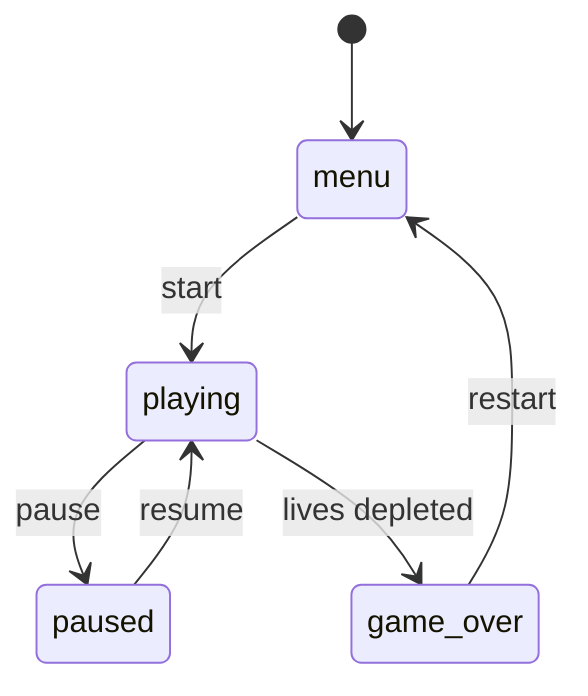
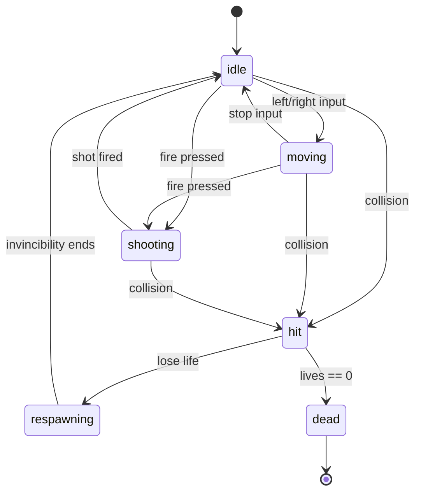
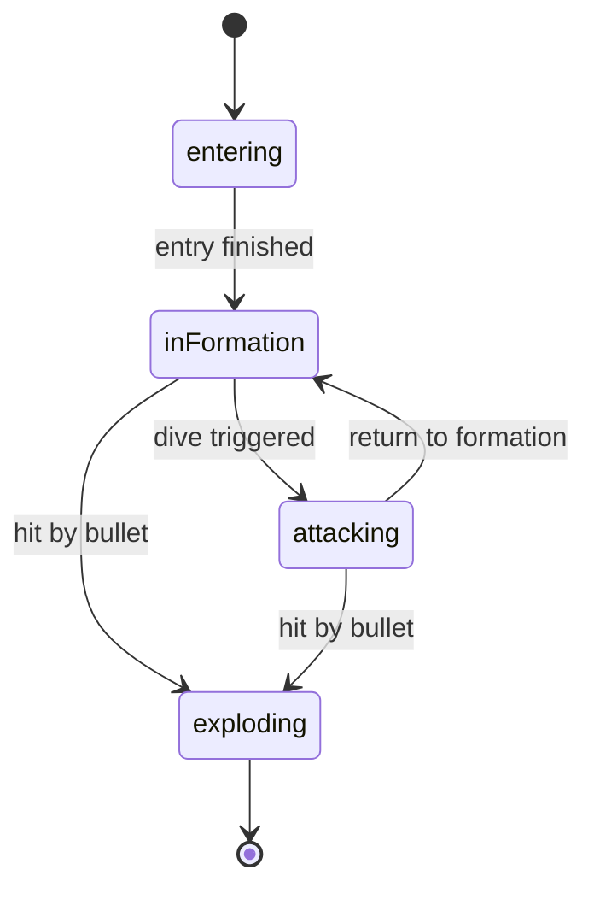
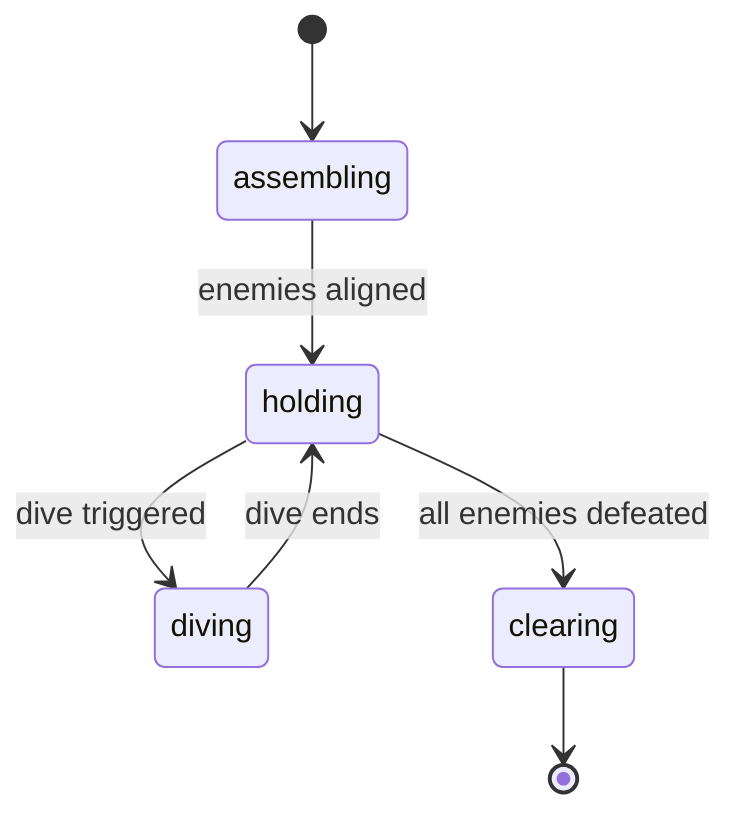
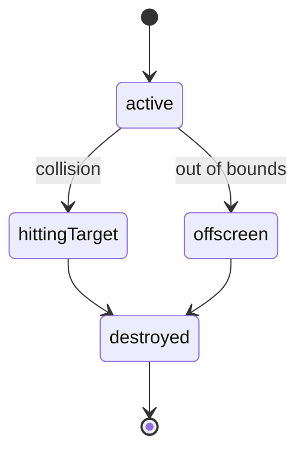
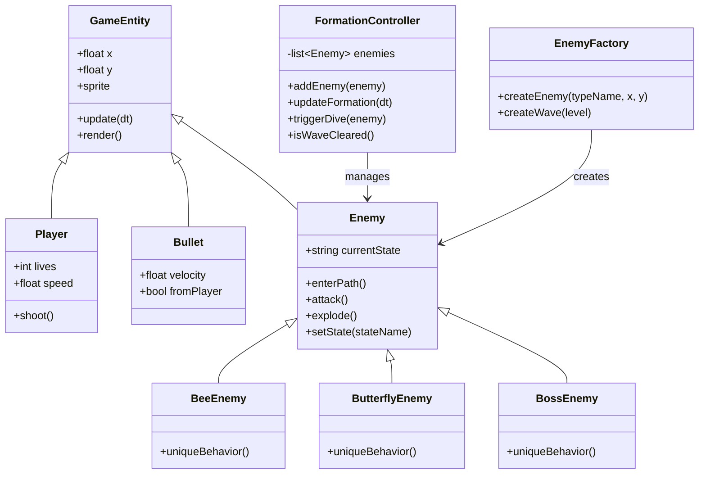

# Final Project

-   [ ] Read the [project requirements](https://vikramsinghmtl.github.io/420-5P6-Game-Programming/project/requirements).
-   [ ] Replace the sample proposal below with the one for your game idea.
-   [ ] Get the proposal greenlit by Vik.
-   [ ] Place any assets in `assets/` and remember to update `src/config.json`.
-   [ ] Decide on a height and width inside `src/globals.js`.
-   [ ] Start building the individual components of your game.
-   [ ] Good luck, you got this!

---

# Star Defenders – Proposal

## ✒️ Description

Star Defenders is a 2D arcade-style space shooter inspired by Galaga. The player controls a spaceship at the bottom of the screen and must destroy waves of alien enemies. Enemies enter using curved paths, then lock into a formation grid managed by a `FormationController`. Individual enemies can break formation and dive toward the player.

Each enemy type is its own class (`BeeEnemy`, `ButterflyEnemy`, `BossEnemy`), all created through an `EnemyFactory`. The game includes collisions, shooting, enemy AI, player lives, scoring, wave progression, and several state machines powering core systems.

This project demonstrates state machines, OOP, factory pattern, hitboxes, animations, tweens, sound integration, and persistent high scores.

---

## 🕹️ Gameplay

- Player moves left/right at the bottom of the screen.
- Player fires bullets upward at alien enemies.
- Enemies fly into the screen on paths, then take preset formation positions.
- FormationController manages spacing, layout, and timed dive attacks.
- Enemies shoot bullets or dive at the player.
- Player loses a life on collision and respawns with temporary invincibility.
- Player clears waves by eliminating all enemies.
- Game ends when all player lives are lost.

Keyboard only control scheme (movement + shooting).

---

## 📃 Requirements

1. Player horizontal movement.
2. Player shooting.
3. Player collision detection + life system.
4. Player respawn behavior.
5. Enemy entry movement paths.
6. Enemies lock into formation positions.
7. Dive attacks from individual enemies.
8. Bullet <-> Enemy collision detection.
9. Enemy <-> Player collision.
10. Score system and UI.
11. Player lives UI.
12. Wave progression system.
13. High score persistence.
14. Shoot/explosion sounds.
15. Sprite rendering.
16. Explosion animations.
17. Tweened enemy entry movement.
18. Player state machine.
19. Enemy state machine.
20. Bullet state machine.
21. FormationController state machine.

---

# 🤖 State Diagrams

## Global Game State Machine

## Player State Machine

## Enemy State Machine (Each Individual Enemy)

## FormationController State Machine

## Bullet State Machine

### 🗺️ Class Diagram

### 🧵 Wireframes

## Main Menu

A retro arcade style main menu with the game title at the top and three pixel-style buttons (“Start Game”, “High Score”, “Quit”). The layout resembles a Galaga-era title screen with minimal UI and a dotted retro border.

## Game Play

A retro pixel art gameplay mockup showing the player ship at the bottom, a block of enemies in formation in the center, with a border reminiscent of arcade cabinets. Score and Lives are displayed at the top in pixel text.

## Pause Menu

A centered retro pause overlay with a “PAUSED” title and two large pixel buttons: “Resume” and “Exit”. The rest of the gameplay screen is dimmed to show the game is halted.

## Wave Complete Screen

A centered retro pause overlay with a “PAUSED” title and two large pixel buttons: “Resume” and “Exit”. The rest of the gameplay screen is dimmed to show the game is halted.

## Game Over Screen

A classic arcade-style “GAME OVER” screen with the final score displayed beneath it. A pixel-style “Return to Menu” button is centered at the bottom.

### 🎨 Assets

We used a pixel-art inspired workflow to create the wireframes for Star Defenders.

For visual direction, we are following trends already established in classic arcade shooters such as Galaga, Space Invaders, and other retro cabinet games that use bold colors, simple shapes, and clear silhouettes. These games rely on instantly recognizable enemy patterns, readable projectiles, and straightforward UI placement all elements we plan to follow.

The overall GUI will remain clean and retro-themed, focusing on clarity over complexity. The goal is to make the game readable at all times: the player should instantly understand where the ship is, where the enemies are, and how many lives or points they have left. The visual design will lean into a nostalgic arcade feel, keeping the experience simple, fun, and authentic to the classic shooter style.

#### 🖼️ Images

Images will be pixel-art style for retro authenticity.

Possible sources:
* spriters-resource.com -> free sprite sheets
* Itch.io -> free pixel-art packs
* Custom modified assets created in Aseprite or similar tools

Images will be mapped through src/config.json.

#### ✏️ Fonts

The game will use retro-inspired fonts for both readability and visual style.

Planned fonts:
* Press Start 2P —> arcade retro title font
* Roboto Mono —> clean HUD/UI text

Both fonts fit the classic shooter theme.

#### 🔊 Sounds
Planned sound effects:
* laser.wav –> player shooting
* enemy_explosion.wav –> enemy destroyed
* player_hit.wav –> player damage
* enemy_dive.wav –> dive attack SFX
* start.wav –> wave start jingle
* bgm_loop.mp3 –> looping background music

Sound files will be stored in /assets/sounds/.

Sound sources may include:

https://freesound.org/

https://opengameart.org/

### 📚 References

* Namco’s Galaga for formation design and movement inspiration
* Retro shooter assets from OpenGameArt
* Pixel art references from Itch.io
* Sound effects from Freesound.org
* MermaidJS documentation for state and class diagrams
