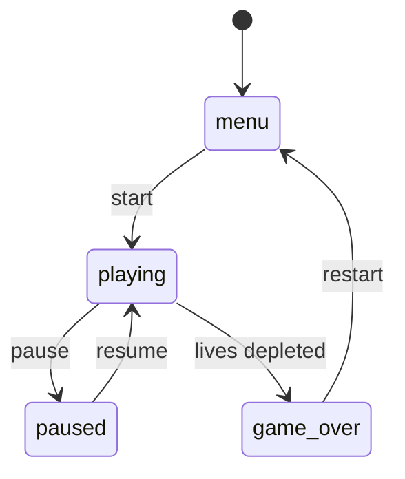
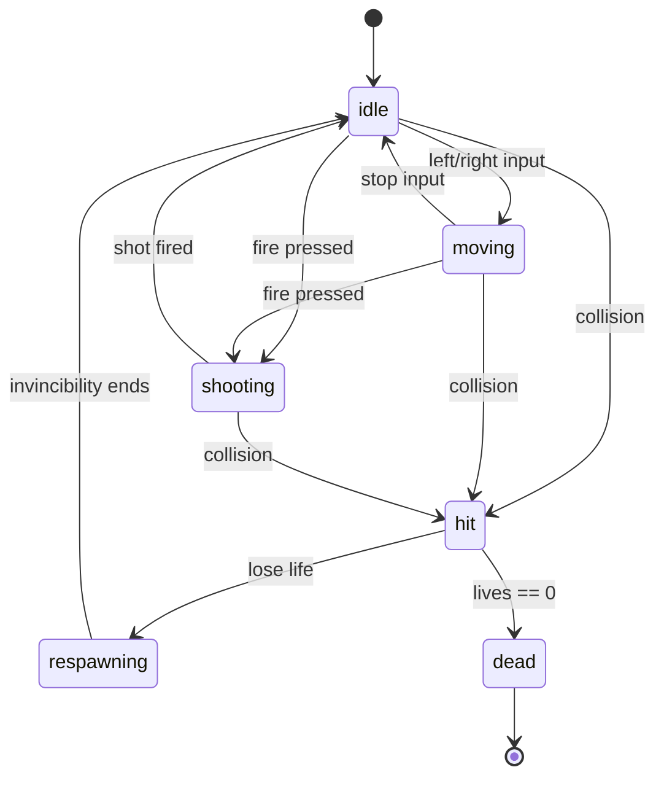
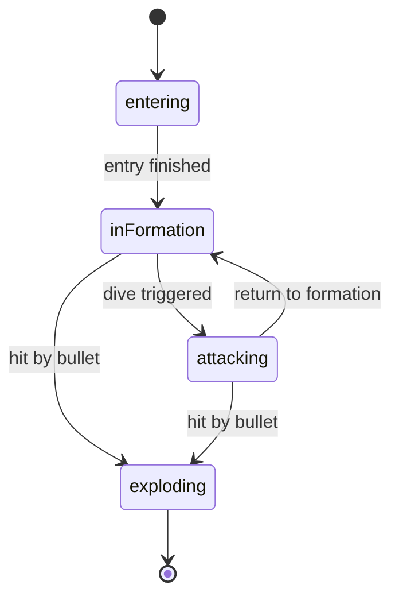
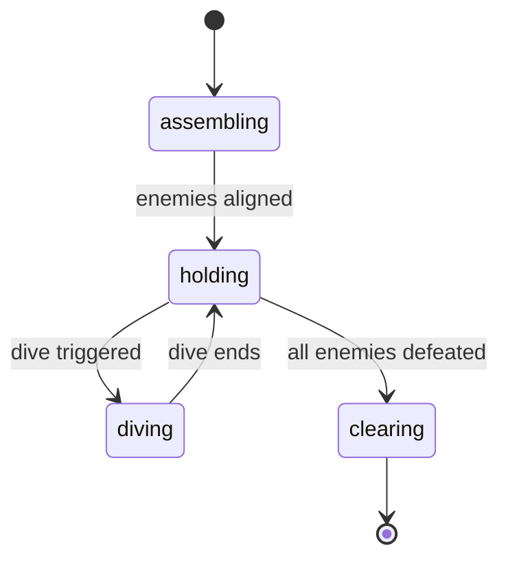
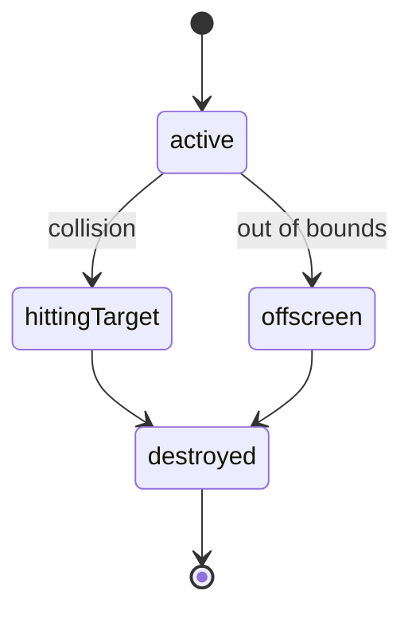
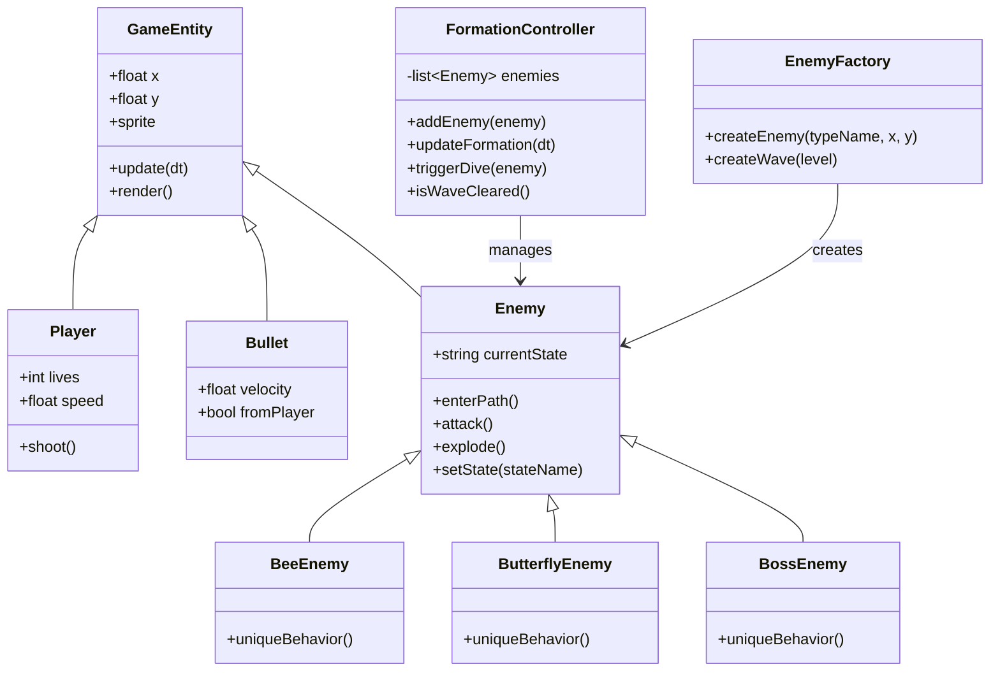

# Final Project

-   [ ] Read the [project requirements](https://vikramsinghmtl.github.io/420-5P6-Game-Programming/project/requirements).
-   [ ] Replace the sample proposal below with the one for your game idea.
-   [ ] Get the proposal greenlit by Vik.
-   [ ] Place any assets in `assets/` and remember to update `src/config.json`.
-   [ ] Decide on a height and width inside `src/globals.js`.
-   [ ] Start building the individual components of your game.
-   [ ] Good luck, you got this!

---

# Star Defenders – Proposal

## ✒️ Description

Star Defenders is a 2D arcade-style space shooter inspired by Galaga. The player controls a spaceship at the bottom of the screen and must destroy waves of alien enemies. Enemies enter using curved paths, then lock into a formation grid managed by a `FormationController`. Individual enemies can break formation and dive toward the player.

Each enemy type is its own class (`BeeEnemy`, `ButterflyEnemy`, `BossEnemy`), all created through an `EnemyFactory`. The game includes collisions, shooting, enemy AI, player lives, scoring, wave progression, and several state machines powering core systems.

This project demonstrates state machines, OOP, factory pattern, hitboxes, animations, tweens, sound integration, and persistent high scores.

---

## 🕹️ Gameplay

- Player moves left/right at the bottom of the screen.
- Player fires bullets upward at alien enemies.
- Enemies fly into the screen on paths, then take preset formation positions.
- FormationController manages spacing, layout, and timed dive attacks.
- Enemies shoot bullets or dive at the player.
- Player loses a life on collision and respawns with temporary invincibility.
- Player clears waves by eliminating all enemies.
- Game ends when all player lives are lost.

Keyboard-only control scheme (movement + shooting).

---

## 📃 Requirements

1. Player horizontal movement.
2. Player shooting.
3. Player collision detection + life system.
4. Player respawn behavior.
5. Enemy entry movement paths.
6. Enemies lock into formation positions.
7. Dive attacks from individual enemies.
8. Bullet <-> Enemy collision detection.
9. Enemy <-> Player collision.
10. Score system and UI.
11. Player lives UI.
12. Wave progression system.
13. High score persistence.
14. Shoot/explosion sounds.
15. Sprite rendering.
16. Explosion animations.
17. Tweened enemy entry movement.
18. Player state machine.
19. Enemy state machine.
20. Bullet state machine.
21. FormationController state machine.

---

# 🤖 State Diagrams

## Global Game State Machine

## Player State Machine

## Enemy State Machine (Each Individual Enemy)

## FormationController State Machine

## Bullet State Machine

### 🗺️ Class Diagram

### 🧵 Wireframes

> [!note]
> Your wireframes don't have to be super polished. They can even be black/white and hand drawn. I'm just looking for a rough idea about what you're visualizing.

-   _Let's Play_ will navigate to the main game.
-   _Upload Cards_ will navigation to the forms for uploading and parsing the data files for the game.
-   _Change Log_ will navigate the user to a page with a list of features/changes that have been implemented throughout the development of the game.

We want to keep the GUI as simple and clear as possible by having cards with relevant images to act as a way for the user to intuitively navigate the game. We want to implement a layout that would look like as if one were playing a match of the Pokémon Trading Card Game with physical cards in real life. Clicking on any of the cards will reveal that card's details to the player.

### 🎨 Assets

We used [app.diagrams.net](https://app.diagrams.net/) to create the wireframes. Wireframes are the equivalent to the skeleton of a web app since they are used to describe the functionality of the product and the users experience.

We plan on following trends already found in other trading card video games, such as Pokémon Trading Card Game Online, Hearthstone, Magic the Gathering Arena, and Gwent.

The GUI will be kept simple and playful, as to make sure the game is easy to understand what each component does and is, as well as light hearted to keep to the Pokémon theme.

#### 🖼️ Images

-   Most images will be used from the well known community driven wikipedia site, [Bulbapedia](https://bulbapedia.bulbagarden.net/wiki/Main_Page).
-   Especially their [Trading Card Game section](<https://bulbapedia.bulbagarden.net/wiki/Full_Art_card_(TCG)>).

#### ✏️ Fonts

For fonts, a simple sans-serif like Roboto will look quite nice. It's a font that is legible, light on storage size, and fun to keep with the theme we're going for. We also used a more cartoonish Pokemon font for the title screen.

-   [Pokemon](https://www.dafont.com/pokemon.font)
-   [Roboto](https://fonts.google.com/specimen/Roboto)

#### 🔊 Sounds

All sounds were taken from [freesound.org](https://freesound.org) for the actions pertaining to cards.

-   [Shuffle cards](https://freesound.org/people/VKProduktion/sounds/217502/)
-   [Flip card](https://freesound.org/people/Splashdust/sounds/84322/)

### 📚 References

-   [Pokemon Rulebook](http://assets.pokemon.com/assets/cms2/pdf/trading-card-game/rulebook/xy8-rulebook-en.pdf)
