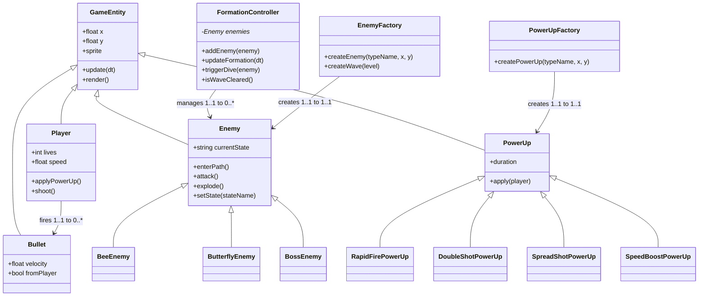

# Final Project

- [ ] Read the [project requirements](https://vikramsinghmtl.github.io/420-5P6-Game-Programming/project/requirements).
- [ ] Replace the sample proposal below with the one for your game idea.
- [ ] Get the proposal greenlit by Vik.
- [ ] Place any assets in `assets/` and update `src/config.json`.
- [ ] Choose a height/width in `src/globals.js`.
- [ ] Start building your components following this proposal.
- [ ] Good luck, you got this!

---

# Star Defenders – Proposal

## ✒️ Description

Star Defenders is a retro-inspired arcade space shooter where the player pilots a starfighter against waves of alien invaders. Enemies appear in organized formations, break away to launch dive attacks, and pressure the player with coordinated movement. The goal is to survive each wave, earn points, collect powerups, and eventually clear all waves to achieve victory.

The experience is fast paced and easy to understand: move left, dodge threats, shoot enemies, collect upgrades, and stay alive. The game embraces a classic arcade feel bright visuals, simple controls, escalating challenge making it enjoyable for both casual and experienced players.

---

# 🕹️ Gameplay

- The player moves left and right at the bottom of the screen.
- Enemies fly onto the screen along paths and settle into formation.
- Individual enemies dive toward the player to attack.
- The player shoots incoming enemies to score points.
- Powerups appear and provide temporary upgrades such as rapid fire or shields.
- The player loses lives when hit and respawns with brief invincibility.
- Clearing all waves results in victory; losing all lives ends the game.

Gameplay is simple, readable, and resembles classic arcade cabinet shooters.

---

# 📃 Requirements (User Stories)

### **Player Actions**
1. The player will be able to move horizontally.
2. The player will be able to fire projectiles.
3. The player will lose a life when hit by an enemy or projectile.
4. The player will respawn with temporary invincibility after losing a life.
5. The player will be able to collect powerups and gain temporary abilities.
6. The player will be able to clear waves by defeating all enemies.

### **Enemy & Formation Behavior**
7. The system will spawn enemies that enter using predefined movement paths.
8. The system will arrange enemies into formation positions.
9. The system will trigger individual enemies to dive at the player.
10. The system will allow enemies to be destroyed by player bullets.

### **Powerups**
11. The system spawns powerups at defined intervals or conditions.
12. The system activates powerup effects immediately upon collection.
13. Powerups influence gameplay, such as shooting speed or defense.

### **Game Flow**
14. The system will track and display the player’s score.
15. The system will show the player's lives remaining.
16. The system will progress to the next wave when enemies are cleared.
17. The system will trigger a victory state when the final wave is cleared.
18. The system will trigger a game over state when no lives remain.
19. The system will save the player’s high score persistently.
20. The system will play sound effects and background music during gameplay.

---

# 🤖 State Diagrams

## **Global Game State Machine**

## Player State Machine

## Enemy State Machine (Each Individual Enemy)

## FormationController State Machine

## Bullet State Machine

## Power Up Machine

---

### 🗺️ Class Diagram

--- 

### 🧵 Wireframes

> [!NOTE]
> Used AI to create wireframe

## Main Menu

A retro arcade style main menu with the game title at the top and three pixel style buttons (“Start Game”, “High Score”, “Quit”). The layout resembles a Galaga era title screen with minimal UI and a dotted retro border.

## Game Play

A retro pixel art gameplay mockup showing the player ship at the bottom, a block of enemies in formation in the center, with a border reminiscent of arcade cabinets. Score and Lives are displayed at the top in pixel text.

## Pause Menu

A centered retro pause overlay with a “PAUSED” title and two large pixel buttons: “Resume” and “Exit”. The rest of the gameplay screen is dimmed to show the game is halted.

## Wave Complete Screen

A centered retro pause overlay with a “PAUSED” title and two large pixel buttons: “Resume” and “Exit”. The rest of the gameplay screen is dimmed to show the game is halted.

## Game Over Screen

A classic arcade style “GAME OVER” screen with the final score displayed beneath it. A pixel style “Return to Menu” button is centered at the bottom.

---

### 🎨 Assets

We used a pixel-art inspired workflow to create the wireframes for Star Defenders.

For visual direction, we are following trends already established in classic arcade shooters such as Galaga, Space Invaders, and other retro cabinet games that use bold colors, simple shapes, and clear silhouettes. These games rely on instantly recognizable enemy patterns, readable projectiles, and straightforward UI placement all elements we plan to follow.

The overall GUI will remain clean and retro-themed, focusing on clarity over complexity. The goal is to make the game readable at all times: the player should instantly understand where the ship is, where the enemies are, and how many lives or points they have left. The visual design will lean into a nostalgic arcade feel, keeping the experience simple, fun, and authentic to the classic shooter style.

---

#### 🖼️ Images

Images will be pixel-art style for retro authenticity.

Possible sources:
* spriters-resource.com -> free sprite sheets
* Itch.io -> free pixel-art packs
* Custom modified assets created in Aseprite or similar tools

Images will be mapped through src/config.json.

---

#### ✏️ Fonts

The game will use retro-inspired fonts for both readability and visual style.

Planned fonts:
* Press Start 2P —> arcade retro title font
* Roboto Mono —> clean HUD/UI text

Both fonts fit the classic shooter theme.

---

### 🔊 Sounds
Planned sound effects:
* laser.wav –> player shooting
* enemy_explosion.wav –> enemy destroyed
* player_hit.wav –> player damage
* enemy_dive.wav –> dive attack SFX
* start.wav –> wave start jingle
* bgm_loop.mp3 –> looping background music

Sound files will be stored in /assets/sounds/.

Sound sources may include:

https://freesound.org/

https://opengameart.org/

---

### 📚 References

* Namco’s Galaga for formation design and movement inspiration
* Retro shooter assets from OpenGameArt
* Pixel art references from Itch.io
* Sound effects from Freesound.org
* MermaidJS documentation for state and class diagrams
